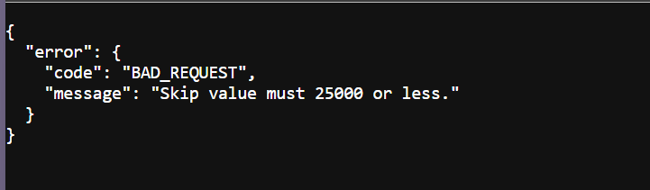

# US.PILLS
***
Prueba técnica con React, MUI y  openFDA API.

> [!NOTE]
Web desplegada [https://uspills.netlify.app/](https://uspills.netlify.app/)

> [!WARNING]
> No está permitido el uso de este código sin consentimiento escrito por su autor.

Tecnologías usadas
=
***

* **React** como framework para la reactividad de la UI
* Componentes de **Material UI** (*React*) 
* **Zustand**, librería para el manejo de estados globales
* **React-Router-Dom** como router para el uso de la app como SPA

Desarrollo y decisiones tomadas
=
***

* A pesar de ser un proyecto relativamente pequeño, he decidido
implementar una **estructura de carpetas completa** como demostración de mi conocimiento
y desenvoltura en **proyectos más grandes**, así como por legibilidad y orden
de la prueba.

* Uso de **HTML5 semántico**

* Para aplicar estilos a los componentes de MUI
 mayoritariamente se ha llevado a cabo **mediante la propia API** de MaterialUI.
Es decir, pasando estilos con el prop *sx* u otros props de la biblioteca..

* Para los estilos generales se ha generado una **estructura de carpetas
para archivos CSS3** y se ha usado una metodología *BEM* para su implementación.

* La paginación de openFDA se lleva a cabo
mediante los parámetros *limit* y *skip*.
He considerado que el número máximo de resultados por página
no debe ser mayor a 20 productos (si los hubiese) para una buena experiencia de usuario.

>Sin embargo, la gran cantidad de resultados devueltos
por los endpoints (algunos con más de 200.000 registros), y por la siguiente
limitación de la API
>>  
hace que en ocasiones los resultados de búsqueda den problemas
> con la páginación propuesta ya que hay páginas que deben saltar más de 25.000
 
items y esto no es permitido por la propia API.
